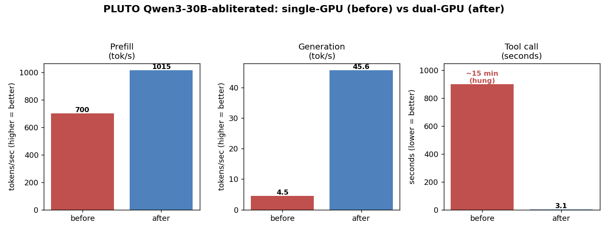
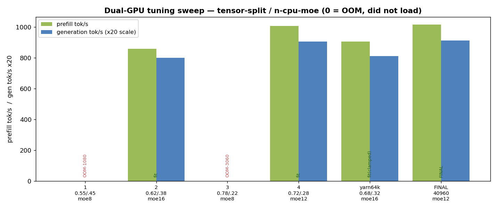
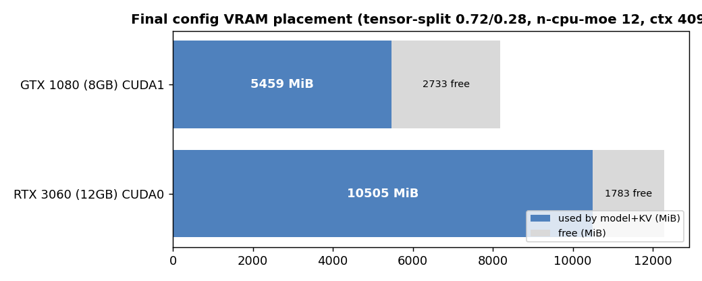

# 2026-06-11 — PLUTO: uncensored Qwen3-30B served on dual GPUs, wired to Hermes

**Host:** `pluto` (Rocky Linux 9.8, booted into Linux side), user `akclark`, LAN IP `172.16.28.162`
**Goal:** serve an uncensored Qwen model on the local network as an OpenAI-compatible
endpoint, wire the Hermes agent to it, and make it fast enough for agent/tool use.

This folder is a **drop-in snapshot**. To rebuild this exact configuration on a fresh
machine (or revert pluto to it), hand [`IMPLEMENTATION.md`](IMPLEMENTATION.md) to a
Claude Code agent along with the files in [`configs/`](configs/).

---

## TL;DR result

| Metric | Before (1 GPU) | After (2 GPU, tuned) |
|---|---|---|
| Prefill | 700 tok/s | **1015 tok/s** |
| Generation (real context) | **4.5 tok/s** | **45.6 tok/s** (~10×) |
| Tool call | hung **~15 min** | **3.1 s** (structured) |
| Real context window | 40960 | 40960 |
| Hermes filesystem task | "can't access files" | ✅ works |



---

## What we serve

- **Model:** `qwen3-abliterated:30b` — Qwen3-30B-A3B **abliterated** (uncensored), Q4_K_M, 18.5 GB.
  - Source: the proven local Ollama blob (`hf.co/mradermacher/Qwen3-30B-A3B-abliterated-GGUF:Q4_K_M`),
    copied to NVMe at `/home/akclark/models/qwen3-abliterated-30b-Q4_K_M.gguf`.
  - 30B Mixture-of-Experts, ~3B active params/token, native context **40960**.
- **Engine:** `llama.cpp` `llama-server` (OpenAI-compatible `/v1`), **not vLLM** — see "Why llama.cpp".
- **Endpoint:** `http://172.16.28.162:8081/v1` (firewall port 8081/tcp open), model id `qwen3-abliterated-30b`.
- **Service:** user-level systemd unit `llama-qwen` (linger-enabled, boot-persistent).
- **Agent:** Hermes Agent v0.16.0 at `/home/akclark/hermes-agent`, config `~/.hermes/config.yaml`,
  `hermes` on PATH via `~/.local/bin/hermes` symlink.

## Hardware (see [`logs/`](logs/) for full captures)

- **GPUs:** RTX 3060 12 GB (Ampere, sm_86, CUDA0) + GTX 1080 8 GB (Pascal, sm_61, CUDA1)
- **CPU/RAM:** Ryzen 5 5600X (6c/12t), 128 GB
- **Driver:** 580.x (CUDA 13 capable); model NVMe `/home`, two NTFS HDDs at `/mnt/hdd1`,`/mnt/hdd2`

---

## How we got here (the story)

1. **Found & served the model.** Both NTFS HDDs were unmounted; mounted them, found the
   uncensored Qwen GGUF in the Ollama/LM-Studio stores, copied it to NVMe, built `llama.cpp`
   with CUDA, and served it on `:8081` via a boot-persistent **user** systemd service
   (user-level because SELinux is enforcing and blocks PID 1 from exec'ing anything in `/home`).
2. **Wired Hermes.** Installed Hermes Agent on the Linux side, pointed it at `localhost:8081`
   with `provider: custom`. Hit the documented **64K context floor** (Hermes refuses models
   under 64K) — set `model.context_length: 65536` in the Hermes config to satisfy it.
3. **Performance problem.** The 30B doesn't fit in 12 GB, so ~16 GB of experts ran on **CPU**.
   Generation collapsed to ~4.5 tok/s under real context and a **tool call ground for 15 minutes**
   (the "Hermes can't access the filesystem" symptom was really tool calls never completing).
4. **Dual-GPU fix.** Rebuilt `llama.cpp` against **CUDA 12.9** (CUDA 13 dropped Pascal/sm_61
   support the 1080 needs) for `sm_61;sm_86`, then split the model across **both cards** with
   `--tensor-split`, moving experts off CPU onto the 1080's VRAM. Result: ~10× generation,
   tool calls in seconds.
5. **Tuned the split.** Four attempts (two OOM'd) converged on `--tensor-split 0.72,0.28`
   (3060:1080) + `--n-cpu-moe 12`. See [`benchmarks.md`](benchmarks.md) and the sweep chart.
6. **Context.** Tested YaRN-64K — it **clamps to the model's native 40960** anyway and costs
   ~10% speed, so we run native **40960** (more than enough; Hermes compresses at ~32K).




---

## Why llama.cpp, not vLLM

The 30B MoE is larger than 12 GB and must spill experts to other VRAM/CPU. vLLM is built for
weights-fully-on-GPU and handles GGUF + partial offload poorly. llama.cpp's `--tensor-split` /
`--n-cpu-moe` are exactly the knobs this hardware needs. (The original request said vLLM; we
documented why it's the wrong tool here and used llama.cpp instead.)

## Why two llama.cpp builds

- `build/` — CUDA 13, **sm_86 only** (3060). Single-GPU fallback. Cannot use the 1080.
- `build-multigpu/` — CUDA 12.9, **sm_61;sm_86**. The live build; uses both cards.

If the 1080 is ever removed (e.g. the planned Tesla V100 swap), revert `LLAMA_BIN` to `build/`
and drop `--tensor-split`, or just raise `N_CPU_MOE`.

## Files in this snapshot

```
configs/
  serve-qwen.sh          # the launch wrapper (all tunables as env vars)
  llama-qwen.service     # user systemd unit (goes in ~/.config/systemd/user/)
  hermes-config.yaml     # Hermes model/provider section (~/.hermes/config.yaml)
  fstab.ntfs-snippet     # the two NTFS HDD mount lines
benchmarks.md / .csv     # all measured numbers incl. the tuning sweep
charts/*.png             # before/after, tuning sweep, VRAM placement (+ make_charts.py)
logs/                    # captured gpu-state, toolchain versions, host info
IMPLEMENTATION.md        # step-by-step runbook for a Claude Code agent to rebuild this
```
